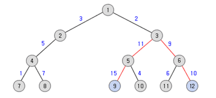

# [백준 1167 트리의 지름](https://www.acmicpc.net/problem/1167)

solved.ac Gold II

## 카테고리

그래프 이론, 그래프 탐색, 트리, 깊이 우선 탐색

## 전체 코드

```java
import java.io.BufferedReader;
import java.io.IOException;
import java.io.InputStreamReader;
import java.util.*;


public class Main {

    static int V;
    static ArrayList<ArrayList<int[]>> graph = new ArrayList<>();
    static boolean[] visit;
    static int max = Integer.MIN_VALUE;
    static int endPoint;

    public static void main(String[] args) throws IOException {
        BufferedReader br = new BufferedReader(new InputStreamReader(System.in));
        StringBuilder sb = new StringBuilder();
        StringTokenizer st;

        int V = Integer.parseInt(br.readLine());
        for(int i = 0; i <= V; i++) {
            graph.add(new ArrayList<>());
        }
        visit = new boolean[V + 1];

        int u, v, cost;
        for(int i = 0; i < V; i++) {
            st = new StringTokenizer(br.readLine());

            u = Integer.parseInt(st.nextToken());
            while(true) {
                v = Integer.parseInt(st.nextToken());
                if(v == -1) break;

                cost = Integer.parseInt(st.nextToken());

                graph.get(u).add(new int[] {v, cost});
            }
        }

        dfs(1, 0);

        max = Integer.MIN_VALUE;
        visit = new boolean[V + 1];
        dfs(endPoint, 0);

        System.out.println(max);
    }

    static void dfs(int now, int dist) {
        if(visit[now]) return;

        visit[now] = true;

        for(int i = 0; i < graph.get(now).size(); i++) {
            if(!visit[graph.get(now).get(i)[0]]) {
                dfs(graph.get(now).get(i)[0], dist + graph.get(now).get(i)[1]);
            }
        }

        if(max < dist) {
            max = dist;
            endPoint = now;
        }
    }
}

```

## 시간복잡도

위 알고리즘은 dfs함수를 두 번 사용하도록 이루어져 있다. dfs의 시간복잡도는 O(V + E)를 가진다.

이 문제에서 트리 정점의 갯수 V의 최대 크기는 100,000이다.

## 풀이

**⏱️소요시간 40분**<br>

문제를 풀기 위해 떠올린 방법은 다음과 같다.

1. 루트 노드에서 가장 먼 노드를 찾는다.
2. 루트 노드에서 가장 먼 노드와 거리가 가장 먼 노드를 찾고 지름을 계산한다.

위 방법을 사용하기 위해서 문제에서 서술한 자료구조는 트리지만 양방향 그래프로 문제를 풀었다.

"1." 에서 루트 노드에서 출발하여 가장 먼 노드를 구하였다. ⭐트리의 특성에 의해 임의의 한 정점에서 가장 먼 정점(Vertex A)으로 가는 경로와 그렇게 구한 정점(Vertex A)에서 가장 먼 정점 사이의 경로는 늘 일정부분 겹치게 된다.



위 트리의 지름은 <span style="color:red">노드 9</span>와 <span style="color:red">노드 12</span>를 연결하는 경로이다. 그럼 임의의 한 노드를 고르고 최장거리를 갖는 다른 노드를 구해보자.

7번 노드 : 7 -> 4 -> 2 -> 1 -> 3 -> 5 -> <span style="color:red">9</span> <br>
2번 노드 : 2 -> 1 -> 3 -> 5 -> <span style="color:red">9</span> <br>
6번 노드 : 6 -> 3 -> 5 -> <span style="color:red">9</span> <br>

5번 노드 : 5 -> 3 -> 6 -> <span style="color:red">12</span> <br>
10번 노드 : 10 -> 5 -> 3 -> 6 -> <span style="color:red">12</span> <br>

위 예시처럼 임의의 한 노드를 고르고 가장 멀리 떨어진 노드를 구한다면 그 노드는 반드시 지름을 구성하는 두 노드 중 하나일 것이다.

따라서 굳이 루트노드를 고를 필요는 없다. 임의의 노드로 부터 가장 먼 노드를 구하기만 하면 된다.
```java
dfs(1, 0); 
```
```java
static void dfs(int now, int dist) {
    if(visit[now]) return;

    visit[now] = true;

    for(int i = 0; i < graph.get(now).size(); i++) {
        if(!visit[graph.get(now).get(i)[0]]) {
            dfs(graph.get(now).get(i)[0], dist + graph.get(now).get(i)[1]);
        }
    }

    if(max < dist) {
        max = dist;
        endPoint = now; // 지름을 구성하는 노드들 중 하나 기억
    }
}
```

위에서 구한 정점에서 dfs 탐색을 출발하여 가장 먼 거리에 위치한 노드까지의 거리가 지름임을 알 수 있다.
```java
max = Integer.MIN_VALUE;
visit = new boolean[V + 1];
dfs(endPoint, 0);
```


## 결과

결과 : [맞았습니다!!](https://www.acmicpc.net/source/65139894)<br>
메모리 : 106848 KB<br>
시간 : 1176 ms<br>
언어 : JAVA<br>
코드길이 : 1492 B<br>
